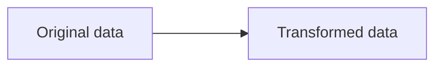
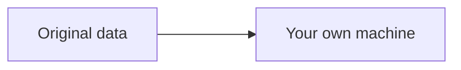

## Directed Acyclic Graph

For each transformation given to PySpark, it evaluates ahead of time and draws a DAG that is useful for optimization. That being said, PySpark is lazily executed.

## Transformations

Creates a DAG.



## Actions

Executes a DAG, does not create dataframe.



## Caching

```python
df.cache()
```

## Collecting

Collect to master node's memory.

```python
df.collect()
```
